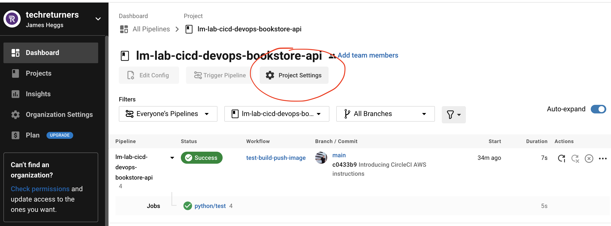
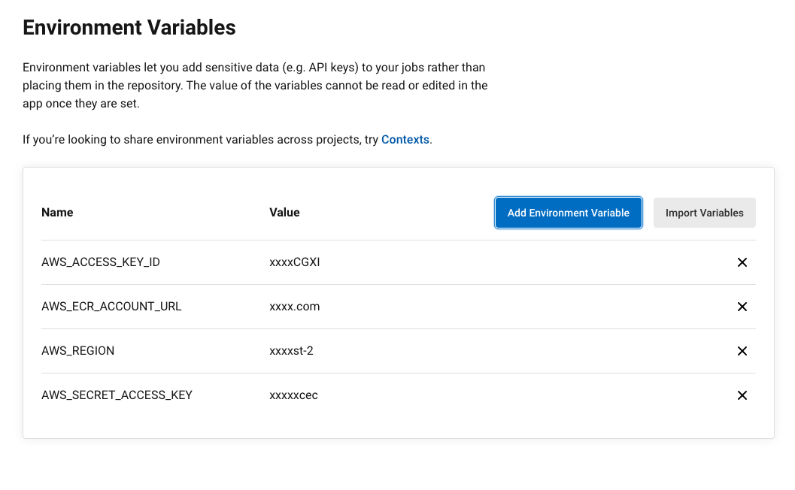

# Pushing your image to container registry

In this stage we'll update your CircleCI pipeline to push to your [Azure Container Registry](https://azure.microsoft.com/en-us/services/container-registry/)

### Pre-requisites

You'll need to have a container registry ready to push your docker images to. The terraform configuration covered in a [previous session](https://github.com/techreturners/lm-lab-aks-gitops-devopsupskill) provisioned your own Azure Container Registry. You can use this to re-create your container registry.

Alternatively you can create a container registry manually using the Azure console.

### Step 1 - Update config.yml

Remember back on the initial setup we utilised a Python CircleCI orb for building the Python application and running the tests. We'll now take that same approach and use the [azure-acr orb](https://circleci.com/developer/orbs/orb/circleci/azure-acr) for building the image and pushing to Azure container registry.

Update your `config.yml` to have the following contents:

**NOTE:** You can also see an [example of this configuration](../.circleci/azure.example.config.yml)

```yaml
version: 2.1

orbs:
  python: circleci/python@1.5.0
  azure-acr: circleci/azure-acr@0.2.0

workflows:
  test-build-push-image:
    jobs:
      - python/test:
          args: '--dev'
          pkg-manager: pipenv
          test-tool: unittest 
      - azure-acr/build-and-push-image:
          login-server-name: REPLACEME.azurecr.io
          registry-name: REPLACEME
          repo: devops-bookstore-api
          tag: '1.$CIRCLE_BUILD_NUM'
          requires:
            - "python/test"
```

If we explore the changes - you can see that we continue to utilise the Python orb and introduce the new `azure-acr` orb.

We also introduce a new `job` called `azure-acr/build-and-push-image`. Let's explore the setup of that job.

Azure has a concept of registries and repositories. A single container registry and have multiple repsoitories. Generally a repository is used per application. For example we might have a single registry for all our applications and then two repositories, one for the frontend and one for the backend API. So as we explore the config you'll see setup for the registry and info relating to the repository.

Firstly we define the login server name that we'll be pushing to `login-server-name: REPLACEME.azurecr.io` and the registry-name: `registry-name: REPLACEME`. The REPLACEME value will need to match the exact name of your container registry. (Side note: Azure container registries have to be globally unique hence we can't define this one for you and you'll need to update it.)

Then we define the "repository" or `repo`. `repo: devops-bookstore-api` this will be the name of the repository within the registry.

Next we define how the Docker image will be tagged. CircleCI provides us with some [built in environment variables](https://circleci.com/docs/2.0/env-vars/#built-in-environment-variables) such as the build number. We make use of that to specify the tag as `1.$CIRCLE_BUILD_NUM`. For example if it was build number 7 then the tag of the image would be **1.7**.

Finally we have the stage `requires` stage. By default CircleCI will run jobs in parallel. By specifying `requires` it means this stage of the build will NOT run until the `python/test` stage has completed.

**NOTE:** Don't commit and push your changes just yet until we've configured Circle with access to your Azure account. If you do accidentally commit and push, don't worry the build will just fail at this point. 

### Step 2 - Configure Circle with Azure access

Currently the [azure-acr orb](https://circleci.com/developer/orbs/orb/circleci/azure-acr) doesn't know how to access your Azure account.

If you browse the orb documentation you can see it mentions different configuration parameters such as the `azure-sp` and the `azure-sp-password`. Those types of *secrets* shouldn't be kept within the code so we'll make use of [storing variables in the CircleCI project](https://circleci.com/docs/2.0/env-vars/#setting-an-environment-variable-in-a-project).


On the CircleCI dashboard navigate to your new project and go into the **Project Settings**



Once there click on **Environment Variables** and click **Add Environment Variable**

Add the following environment variables, entering the name exactly as shown:

| Name        | Value       |
| ----------- | ----------- |
| AZURE_SP       | Azure SP info here     |
| AZURE_SP_PASSWORD      | Azure SP password here     |

Once you have configured your **Environment Variables** it should look similar to the image below:



Now the required environment variables are there, let's see if the build pipeline works.

**Commit** and **Push** your changes back to GitHub. CircleCI should automatically spot it and kick into action.....Grab yourself a drink whilst it builds 🙌

### Step 3 - Review build and Azure container registry

After you've had your drink, have a check of the pipeline - did it run sucessfully?

If it didn't have a look at the logs on CircleCI, some likely causes:

* Incorrect YAML indentation - That pesky YAML needs to be indented correct. Try comparing it with the example file.
* Missing or incorrect environment variable - Double check your CircleCI environment variables. Have you done them all? Are the name and values all correct?

If your build "went green" have a look at your Azure registry - you should see a brand new Docker image all ready to go 🚀 

In the images below you can see a succesful build in CircleCI, build number XXX which resulted in a Docker image with the tag 1.XXXX


### Step 4 - You did it!

You've done it 🚀 🚀 🚀 

You've successfully automated a continuous integration and continuous delivery pipeline. You could now use that Docker image and deploy it using your lovely GitOps pipeline!!!

Time to celebrate and don't forget those screenshots!!!


